# Specimen Archive

**Specimen Archive** — веб-приложение на Django для ведения архива экспериментальных биообъектов и связанных с ними биоинцидентов.  
Проект оформлен в стилистике закрытой внутренней системы: с реестром образцов, журналом инцидентов, страницами детального просмотра, формами добавления и редактирования, а также интерактивным сценарием доступа к досье и выбора протокола реагирования.

## Описание проекта

Система предназначена для хранения и просмотра информации об экспериментальных образцах и инцидентах, связанных с ними.  
Основная идея проекта — не только отображение записей, но и имитация внутреннего протокола доступа: пользователь открывает досье образца, проходит последовательные шаги анализа и принимает решение по активному инциденту. Результат вмешательства сохраняется в журнале и влияет на состояние данных в системе.

## Основные возможности

- просмотр главной страницы с общей системной сводкой;
- просмотр списка образцов;
- просмотр списка инцидентов;
- создание, редактирование и удаление образцов;
- создание, редактирование и удаление инцидентов;
- просмотр детальной страницы образца;
- просмотр детальной страницы инцидента;
- интерактивный сценарий доступа к досье;
- выбор роли доступа и протокола реагирования;
- фиксация результата вмешательства в журнале;
- автоматическое изменение состояния образца и инцидента после завершения сценария;
- отображение последних действий системы на главной странице;
- заполнение проекта демонстрационными данными через management command.

## Используемые технологии

- Python
- Django
- HTML
- CSS
- JavaScript
- SQLite

## Логика работы сценария доступа

В проекте реализован интерактивный модальный сценарий работы с досье образца:

1. открытие доступа к досье;
2. выбор роли доступа;
3. просмотр системной ситуации;
4. выбор протокола реагирования;
5. получение результата вмешательства;
6. переход в журнал решения.

Если у образца есть активный инцидент, система предлагает пройти сценарий реагирования.  
Если активного инцидента нет, система открывает досье в режиме просмотра и фиксирует факт доступа.

После завершения сценария результат сохраняется в базе данных и отображается:
- на главной странице;
- в истории вмешательств;
- в карточках образцов;
- в карточках инцидентов;
- на отдельной странице журнала решения.

## Запуск проекта

### 1. Клонирование репозитория

```bash
git clone https://github.com/Smetik/SpecimenArchive.git
cd SpecimenArchive
```

### 2. Создание и активация виртуального окружения

#### macOS / Linux

```bash
python3 -m venv .venv
source .venv/bin/activate
```

#### Windows

```bash
python -m venv .venv
.venv\Scripts\activate
```

### 3. Установка зависимостей

```bash
pip install -r requirements.txt
```

### 4. Применение миграций

```bash
python manage.py migrate
```

### 5. Заполнение проекта демонстрационными данными

```bash
python manage.py seed_demo_data
```

### 6. Запуск сервера разработки

```bash
python manage.py runserver
```

После запуска проект будет доступен по адресу:

```text
http://127.0.0.1:8000/
```

## Демонстрационные данные

Локальная база данных не хранится в репозитории.  
Для восстановления наполненного состояния проекта используется команда:

```bash
python manage.py seed_demo_data
```

Она создаёт демонстрационные:
- образцы;
- инциденты;
- журналы решений.

Это позволяет получить готовую рабочую версию проекта после клонирования репозитория.

## Структура проекта

```text
SpecimenArchive/
├── archive/                 # основное приложение
├── config/                  # настройки проекта Django
├── docs/screenshots/         # скриншоты интерфейса
├── manage.py
├── requirements.txt
└── README.md
```

## Скриншоты интерфейса

### Главная страница

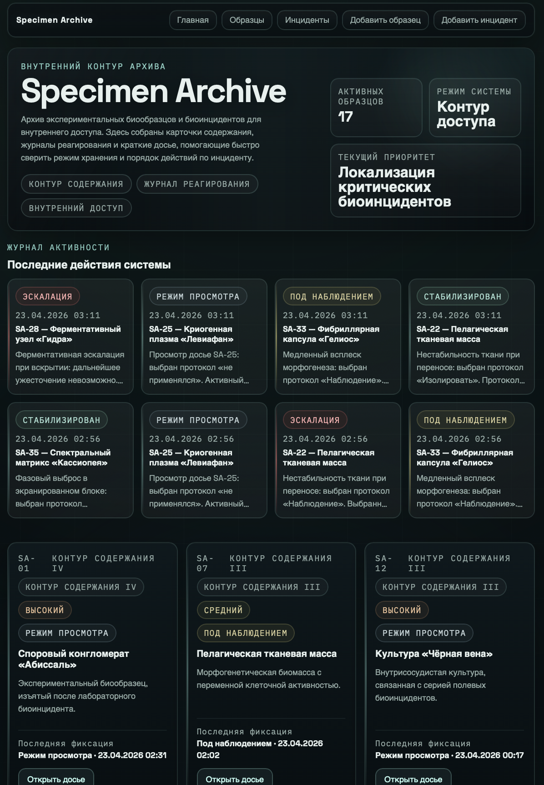

### Список образцов

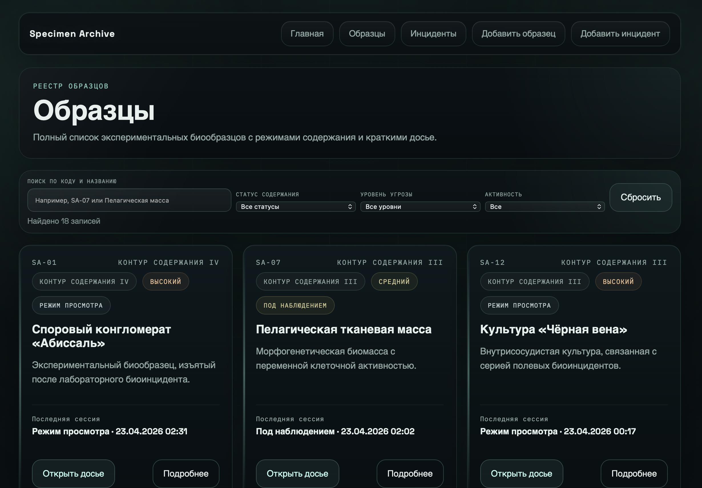

### Список инцидентов

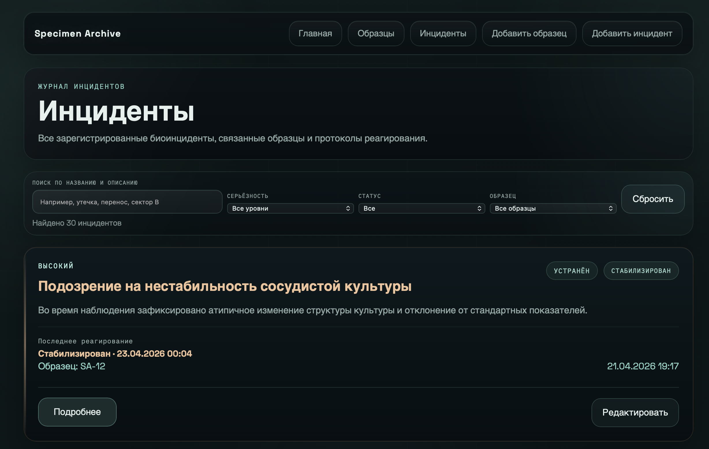

### Добавление образца

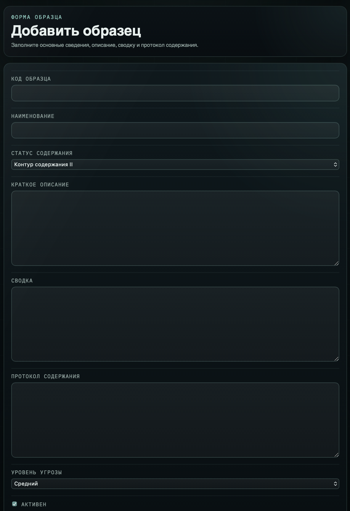

### Добавление инцидента

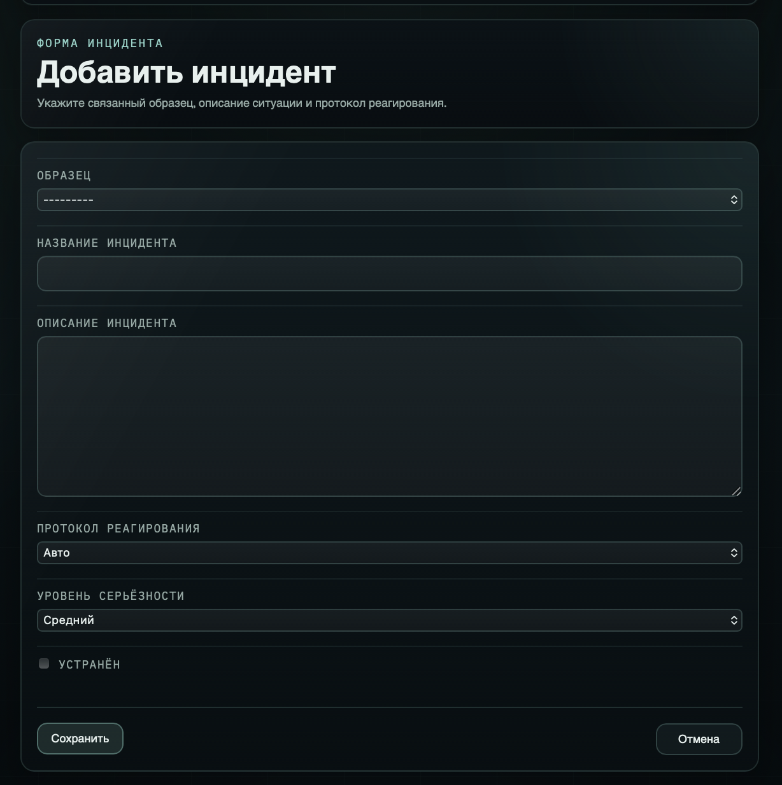

## Скриншоты сценария доступа

### Шаг 1

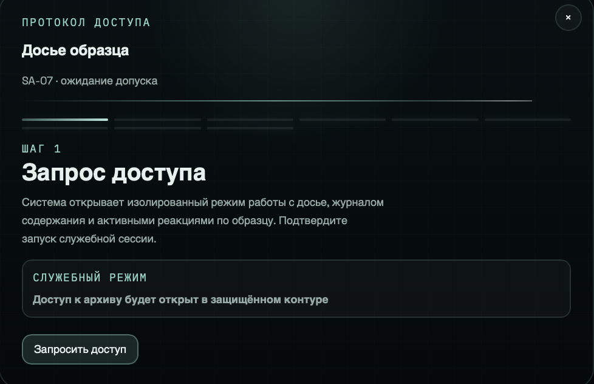

### Шаг 2

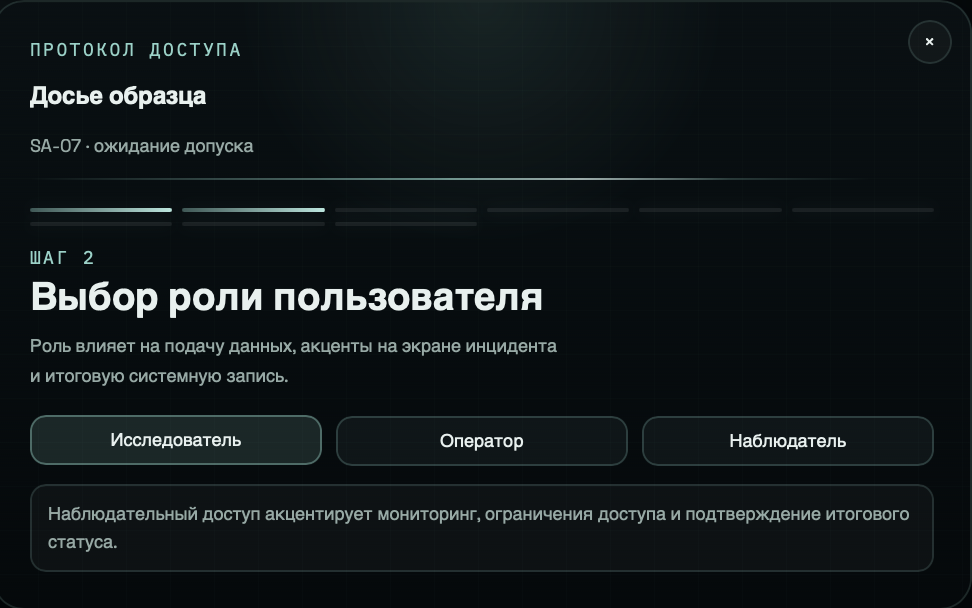

### Шаг 4

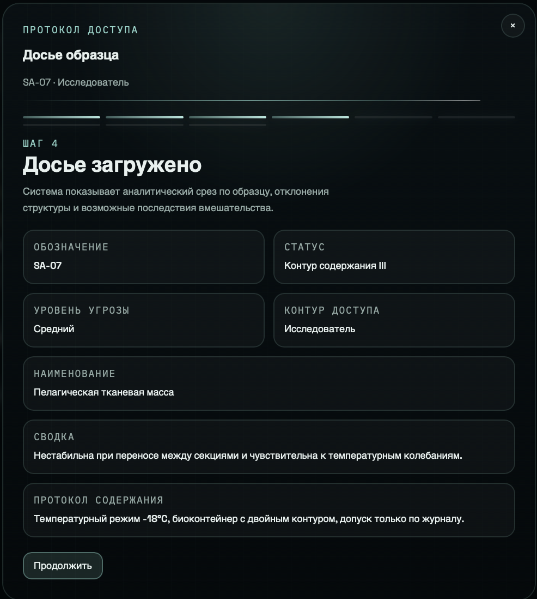

### Шаг 5

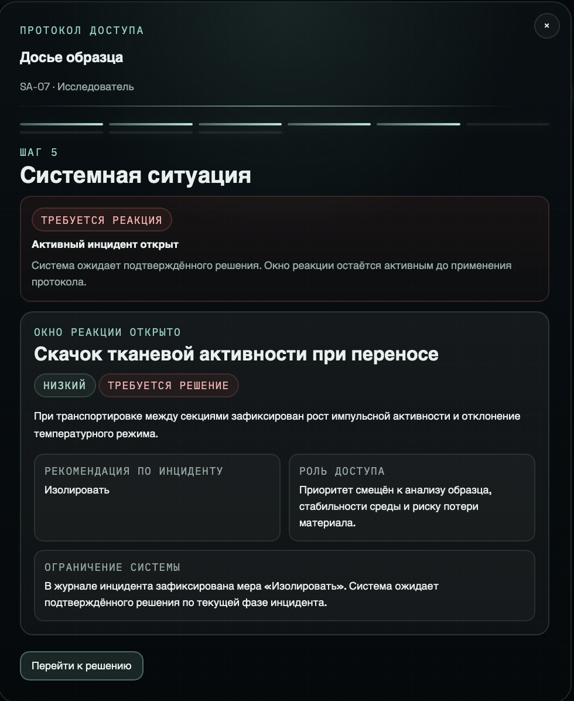

### Шаг 6

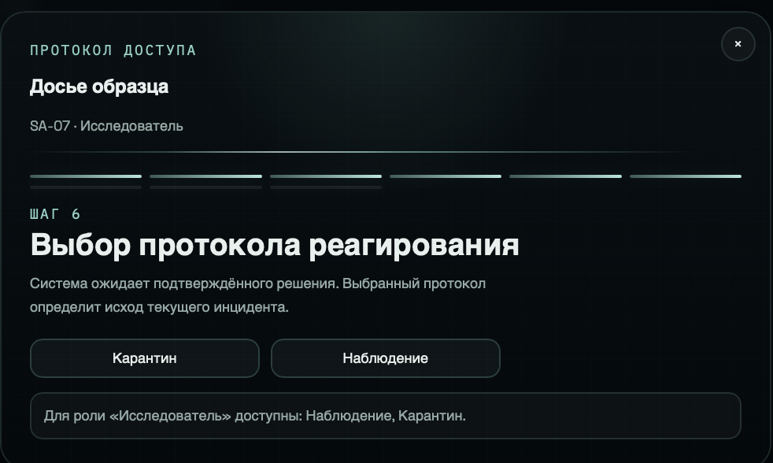

### Шаг 8

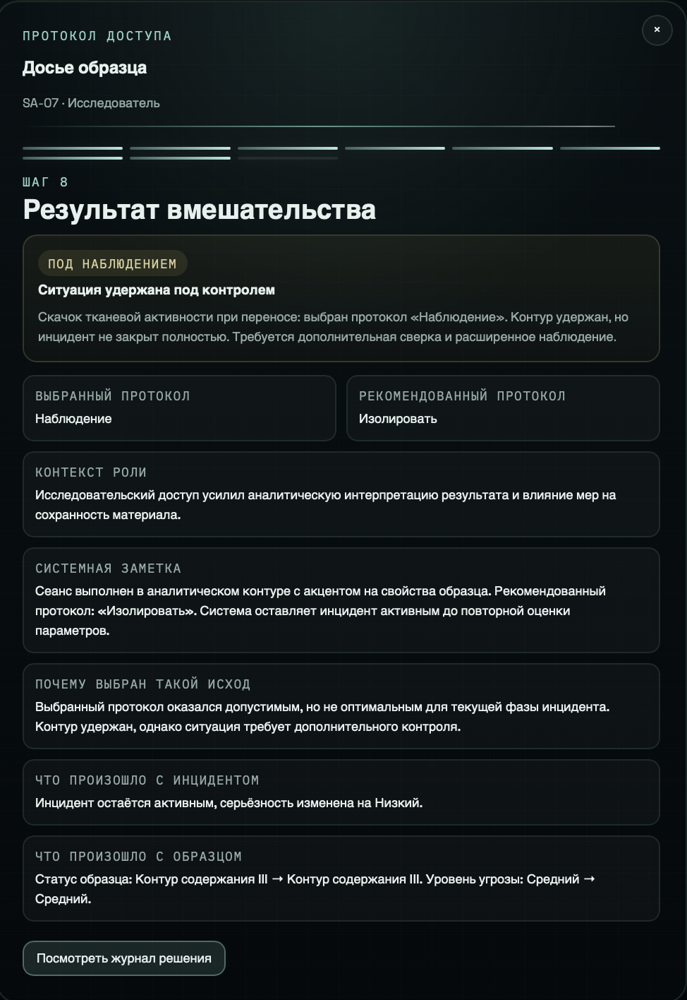

### Шаг 9

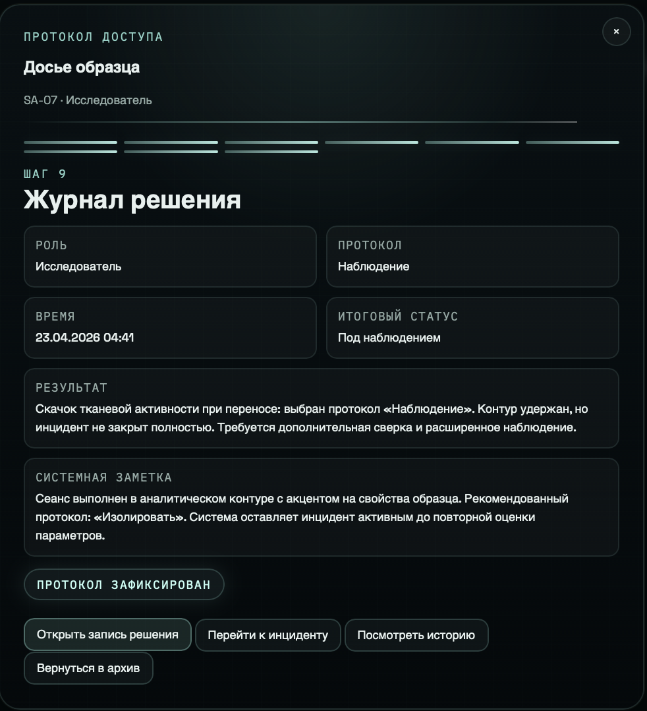

## Проверка работоспособности

Для корректной работы проекта необходимо выполнить:

```bash
python manage.py migrate
python manage.py seed_demo_data
python manage.py runserver
```

Проект должен запускаться без ошибок, а все основные разделы интерфейса должны быть доступны:
- главная страница;
- образцы;
- инциденты;
- формы добавления;
- интерактивное досье;
- журнал решений.

## Внимание

Проект выполнен в рамках учебной разработки по теме создания интерактивной информационной системы на Django.